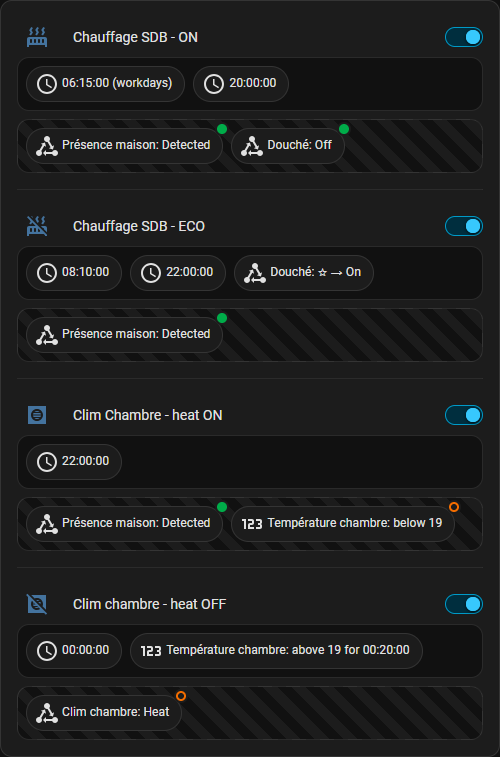

# Automation glance

Home Assistant card to display details about automations.



## Features

- Automation icon and name
- Toggle for automation activation
- Automation description
- List of triggers and conditions

The following domains are supported:

- calendar
- conversation
- event
- numeric_state
- state
- sun
- tag
- template
- time_pattern
- time
- trigger
- webhook
- zone

For other domains, please open an issue.


## Installation

### HACS

The card is available in [HACS](https://hacs.xyz/).

Simply click on the button to open the repository in HACS or search for "Automation Glance" and download it through the UI.

[](https://my.home-assistant.io/redirect/hacs_repository/?owner=mistic100&repository=hass-automation-glance&category=plugin)

### Manual

1. Download `automation-glance.js` from [latest release](https://github.com/mistic100/hass-automation-glance/releases/latest)
2. Put `automation-glance.js` file into your `config/www` folder.
3. Add a reference to `automation-glance.js` via two ways:
    - **Via UI:** _Settings_ → _Dashboards_ → _More Options icon_ → _Resources_ → _Add Resource_ → Set _Url_ as `/local/automation-glance.js` → Set _Resource type_ as `JavaScript Module`.  
      **Note:** If you do not see the Resources menu, you will need to enable _Advanced Mode_ in your _User Profile_

    - **Via YAML:** Add following code to `lovelace` section in your `configuration.yaml` file
      ```yaml
        resources:
            - url: /local/automation-glance.js
              type: module
      ```


## Usage

The card can be configure through the UI or manually.

### Example configuration

```yaml
type: custom:automation-glance
title: 'Chauffages'
entity:
  - automation.chauffage_sbd_on
  - automation.chauffage_sdb_off
  - automation.clim_chambre_on
  - automation.clim_chambre_off
showDescription: false
showToggle: true
showConditions: true
showId: true
showTooltip: true
```

### Options

| Name | Type | Default | Description |
|------|------|---------|-------------|
| `type` **(required)** | string | | `custom:automation-glance` |
| `entity` **(required)** | list | | List of `automation` entities |
| `title` | string | | Title of the card |
| `showDescription` | boolean | `true` | Displays the description of the autamation |
| `showToggle` | boolean | `true` | Displays the automation activation toggle |
| `showConditions` | boolean | `true` | Displays conditions bellow triggers |
| `showId` | boolean | `true` | Displays specific triggers id as small badge |
| `showTooltip` | boolean | `true` | Adds a tooltip to visualize the raw trigger configuration |


## License

This project is licensed under the MIT License - see the [LICENSE](LICENSE) file for details.
